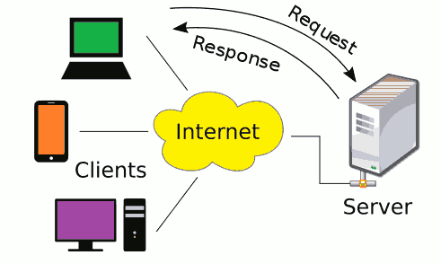

# Netzwerke und Internet (1)

## Überblick

In der Informatik verstehen wir unter einem **Netzwerk** einer Computernetz, bei dem Programme auf Computern untereinander Informationen austauschen können.

Diese Netzwerke können in einem abgeschlossenen räumlichen Bereich realisiert sein (**Intranet**), oder auch die ganz Welt umspannen (**Internet**).

Damit der Informationsaustausch gelingen kann, müssen Programme und Rechner-Hardware verschiedene **Netzwerkprotokolle** erfüllen. In solchen Netzwerkprotokollen (auch *Kommunikationsprotokoll* genannt) sind alle erforderlichen Regeln und Vorgaben niedergeschrieben.

Wir werden uns der Thematik aus dem Blickwinkel eines Web-Browser nähern. Wir gehen davon aus, dass ein Mensch im Browser die URL einer Textdatei eingibt, und der Browser sich von einem Server diese Datei herunterladet und anzeigt.

---------------------------
***Weiterführende Informationen in Wikipedia:***  
* [Rechnernetz](https://de.wikipedia.org/wiki/Rechnernetz)
* [Netzwerkprotokolle](https://de.wikipedia.org/wiki/Netzwerkprotokoll)
---------------------------

### Wie werden Informationen auf Rechnern gespeichert?

Informationen werden in Form von **Dateien** (*Files*) auf einem Datenträger (Festplatte, ...) gespeichert. Der Datenträger ist in der Regel partitioniert und er muss mit einem Dateisystem (NTFS, ext4, ...) formatiert sein. Eine Datei besteht aus einer Menge an Bytes, wobei die Datei auch leer sein darf (es existiert dann nur der "Name" der Datei im Dateisystem). Ein Byte ist eine Gruppe von 8 Bit, die als Binärcode (Dualcode) verstanden werden darf. Mit 8 Bit lässt sich eine Zahl im Bereich 0 bis 255 (Hex FF) bilden. Eine Datei kann daher auch als Menge von Bits gesehen werden.

Informationen werden in Form von Bytes codiert, das heisst, ein **Code** legt fest wie die Information in Bytes umgewandelt werden kann. Ist diese Umwandlung abgeschlossen, können die Bytes in einer Datei gespeichert werden und repräsentieren die Information in digitaler (elektronischer) Form.

**Beispiel: UTF-8 Code**  
Der Text (die Information) "Guten Morgen Österreich" soll in einer Datei UTF-8 codiert gespeichert werden. Der Inhalt wird mit Hilfe eines Texteditors erstellt und in einer Datei gespeichert. Der Inhalt der Datei kann auf zB auf einem Linux-System mit dem Kommando `hexdump -C` ausgegeben werden.

Ergebnis:
```
00000000  47 75 74 65 6e 20 4d 6f  72 67 65 6e 20 c3 96 73  |Guten Morgen ..s|
00000010  74 65 72 72 65 69 63 68  0a                       |terreich.|
00000019
```

Die Umwandlung der Information in Bytes wird **Codierung** (*encoding*) genannt, der umgekehrte Vorgang heisst Decodierung (*decoding*). 
Codierung bzw. Decodierung darf nicht mit Verschlüsselung (*encryption*) bzw. Entschlüsselung (*decryption*) verwechselt werden!

Für unterschiedliche Arten an Information stehen verschiedene "Codes" zur Verfügung:  
* Texte: UTF-8, UTF-16, ASCII, Ansi COde Pages, ...
* Textdokumente: pdf, odt, docx, ...
* Bilder: png, jpeg, svg, ...
* Video: MPEG-2, H.264, ...
* Web-Seiten: HTML, CSS, ...
* ...

---------------------------
***Weiterführende Informationen in Wikipedia:***  
* [Datei](https://de.wikipedia.org/wiki/Datei)
* [Code](https://de.wikipedia.org/wiki/Code)  
---------------------------

### Server/Client Prinzip

In Netzwerken ist häufig das *Server/Client-Prinzip* anzutreffen. Bei einem solchen System stellt der Server Informationen zur Verfügung, und der Client kann diese Informationen abfragen. Server und Client sind Programme die am gleichen Rechner oder auf unterschiedlichen Rechnern laufen können.



Der Vorgang der Abfrage besteht dabei aus zwei Teilen:  
1) **Request**: Der Client richtet eine Anfrage (den *Request*) an den Server. Die Anfrage beinhaltet die Information was der Client haben möchte, zB in Form eines **URI** (*Uniform Resource Identifier*).
2) **Response**: Der Server bearbeitet die Anfrage und sendet eine Antwort (die *Response*) an den Client zurück.

Server und Client müssen dabei die gleiche "Sprache" sprechen, sich also an eine bestimmtes Protokoll halten. Im Internet kommt dafür häufig das **Hypertext Transfer Protocol (HTTP)** zum Einsatz.

---------------------------
***Weiterführende Informationen in Wikipedia:***  
* [Client-Server-Modell](https://de.wikipedia.org/wiki/Client-Server-Modell)
* [URI](https://de.wikipedia.org/wiki/Uniform_Resource_Identifier)
* [HTTP](https://de.wikipedia.org/wiki/Hypertext_Transfer_Protocol)
---------------------------

### URI und URL

Ein *URI* bzw. ein *URL* wird zum Beispiel im Web-Browser eingegeben um eine bestimmte Web-Seite anzuzeigen. Die **URL** ist eine spezielle Form des **Uniform Resource Identifier** (*URI*) und bezeichnet ein Ziel, das über den Browser via HTTP (der "Sprache" zwischen Server und Client) heruntergeladen werden kann.

Er besteht immer aus folgenden Teilen:

```
scheme ":" hierachical-part [ "?" query ] [ "#" fragment ]
```
Die eckigen Klammern [] symbolisieren Teile, die auch fehlen können!

Einfaches Beispiel:

```
https://www.htl-mechatronik.at/gitweb/me17
  \_/   \____________________/ \_________/
   |              |                 |
scheme        authority           path
```

Komplexes Beispiel:

```
https://sx@www.htl-mechatronik.at:443/gitweb/me17?p=sx-aiit.git;a=summary#description
  \_/   \___________________________/ \_________/ \_____________________/ \_________/
   |                |                     |                 |                 |
scheme         authority                path              query           fragment
```

In diesem komplexen Beispiel besteht der authority-Teil aus der Benutzerkennung (sx), dem Hostnamen (www.htl-mechatronik.at) und der Portnummer (443). Der Query-Teil besteht aus den zwei Parametern p (sx.aiit.git) und a (summary). Das Fragment dient in der Regel dazu eine bestimmte Stelle (Anker) in der heruntergeladenen "Resource" anzuspringen. Das Fragment wird nicht an den Server übertragen.

---------------------------
***Weiterführende Informationen in Wikipedia:***  
* [URI](https://de.wikipedia.org/wiki/Uniform_Resource_Identifier)
---------------------------