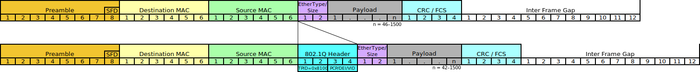

# Netzwerke und Internet (5)

## Schritt 4: Transport von Daten durch das Netz

Wenn der Client seinem Socket einen Request übergibt, so beginnt die Netzwerk-Software im Betriebssystem des Client-Rechners aktiv zu werden.

Im Normalfall erfolgt mit Hilfe der folgenden Protokolle ein Weitertransport der Bytes an den Ziel-Socket auf einem anderen Rechner.

* **TCP** (*Transmisson Control Protocol*)
* **IP**  (*Internet Protocol*)
* **Ethernet** und/oder **WLAN**

### Datenpakete

Die Daten (HTTP Request und Response) werden, falls sie zu viele Bytes haben, in kleinere Datenpakete zerlegt. Diese Datenpakete werden unabhängig voneinander durch das Netzwerk vom Sender-Socket zum Ziel-Socket transportiert. Jedes Protokoll ergänzt dabei Informationen die für die Verarbeitung erforderlich sind. Dadurch werden die Datenpakete mit jedem Protokoll ein wenig größer.

Das Bild zeigt, dass die Datenpakete nacheinander jedes Protokoll durchlaufen, und dabei immer ein wenig größer werden. Man spricht in diesem Zusammenhang auch von Schichten (Layer) die nacheinander durchlaufen werden. Also TCP-Layer, IP-Layer, ...

Folgender Link zeigt eine Video-Animation:  
[YouTube - Animation of packet Transmission through Layers of TCP/IP](https://www.youtube.com/watch?v=aaJ1KcCDz-c)

-------------------------------------------------------

### TCP (Transmission Control Protocol)

TCP, das erste nun zum Einsatz kommende Protokoll, vergibt für jedes Byte eine fortlaufende 32-Bit große Nummer, die **Sequence Nummer**. Damit Server und Client die gleiche Nummerierung verwenden, kommt es bei der Verbindungsaufnahme zu einem Abgleich, einer Synchronisierung dieser Nummer. Davon kommt auch der Name SYN-Paket, das Paket das bei der Verbindungsaufnahme entsendet wird.

Nun müssen die Daten in Datenpakete zerlegt werden. Bei TCP spricht man dabei von einer Zerlegung in **TCP-Segmente**. Jedes Segment kann eine maximale Anzahl an Bytes aufnehmen, üblicherweise **1500 Bytes** (*MTU* = *Maximum Transmission Unit*). In unserem Beispiel kann der Request in einem TCP-Segment gesendet werden, für die Response (Header + 4000 Byte Nutzdaten) sind aber mindestens drei TCP/IP-Segmente erforderlich.

Jedes TCP-Segment wird mit einem TCP-Header versehen. Dieser TCP-Header besteht aus mindestens 20 Bytes und hat folgenden Aufbau:

Die 32-Bit Sequence Number ist die Nummer des ersten Nutzdatenbyte. Weiters enthält der Header die Portnummer des eigenen Socket (*Source Port*) und die des Ziel-Socket (*Destination Port*). Eine *Checksum* dient als Prüfsumme, damit beim Empfänger überprüft werden kann, ob es im Datenbereich zu Übertragungsfehlern gekommen ist.

Das Datenpaket (User-Data + TCP Header) wird nun dem IP-Protokoll übergeben, und bleibt im TCP-Layer gespeichert bis ein Paket in Gegenrichtung über die *Acknowledge Number* die gesendeten Bytes bestätigt. Falls die Bestätigung ausbleibt, wird das Paket in einem bestimmten Zeitabstand nochmals gesendet (genauere Infos siehe [Stackoverflow 12956685](https://stackoverflow.com/questions/12956685)).

---------------------------
***Weiterführende Informationen in Wikipedia:***

* [Transmission Control Protocol (deutsch)](https://de.wikipedia.org/wiki/Transmission_Control_Protocol)
* [Transmission Control Protocol (englisch)](https://en.wikipedia.org/wiki/Transmission_Control_Protocol)
-------------------------

### IP (Internet Protocol)

Der IP-Layer bekommt vom TCP-Layer ein Datenpaket übergeben, und weiß an welche Zieladresse (IPv4 oder IPv6) das Paket zu senden ist.

Es versieht das Paket mit einem IP-Header. Dieser IP-Header besteht aus mindestens 20 Bytes und hat folgenden Aufbau:

Der Header enthält unter anderem die Länge der Daten (*TL*), die eigene Absender IP-Adresse (*Source IP Address*) und die Empfänger IP-Adresse (*Destination IP Address*) des Ziel-Socket.

Solange die Ziel-IP nicht mit der eigenen IP-Adresse übereinstimmt, wird der IP-Layer das Datenpaket (IP-Header + TCP Datenpaket) an den nächsten Layer (Ethernet oder WLAN) übergeben.

Hauptaufgabe des IP-Protokolls ist die Wegfindung im Netzwerk, das sogenannte **Routing**. Das Datenpaket muss über viele Rechner (Router) hinweg zum Zielrechner transportiert werden.

---------------------------
***Weiterführende Informationen in Wikipedia:***

* [Internet Protocol (deutsch)](https://de.wikipedia.org/wiki/Internet_Protocol)
* [Internet Protocol (englisch)](https://en.wikipedia.org/wiki/Internet_Protocol)
-------------------------

### Ethernet und WLAN

Diese beiden Protokolle sind für den tatsächlichen Transport der Information über ein Medium verantwortlich. Bei Ethernet ist das in der Regel ein Kabel aus Kupfer oder Glasfaser, bei WLAN (*Wireless Local Area Network*) ist das Medium der freie Raum (drahtlose Funkübertragung).

Das vom IP-Layer übergebene Datenpaket wird auch hier wieder mit einem Header versehen. Als Adressen kommen nun **MAC-Adressen** zum Einsatz. Die Abkürzung MAC steht für *Media Access Control*.

Eine MAC-Adresse besteht aus 48 Bit und wird hexdezimal angeschrieben. Mehrere Schreibweisen sind in Verwendung:

* Linux, macOS: **50:3f:56:02:2b:01**
* Windows: 50-3f-56-02-2b-01
* HP-Switch/Router: 503f56-022b01

Das aus Ethernet-Header und Daten (IP-Daten) gebildete Paket hat folgenden Aufbau:

Es enthält unter anderem die MAC-Adresse des Senders und Empfängers.

Bei WLAN sieht das Datenpaket etwas anders aus:

Hier sind vier MAC-Adressen gespeichert, von denen im Normalfall nur drei (Sender, Empfänger, Access-Point) benötigt werden. 

--------------------------------
***Weiterführende Informationen in Wikipedia:***

* [Ethernet](https://de.wikipedia.org/wiki/Ethernet)
* [Wireless Local Area Network](https://de.wikipedia.org/wiki/Wireless_Local_Area_Network)
--------------------------------

### Routing (Wegfindung)

Der Ethernet- bzw. WLAN-Layer übertragen ein Datenpaket zum nächstgelegenen Rechner, der über die MAC-Adresse gefunden wird.

Falls es mehr als einen möglichen Weg gibt, entscheidet der IP-Layer an welche benachbarte IP-Adresse das Paket zu senden ist. 

Bei IPv4 Netzen kann jeder Rechner über das Address Routing Protocol (ARP) die MAC-Adresse und IP-Adresse eines jeden Rechners in seiner unmittelbaren Umgebung ausfindig machen.

