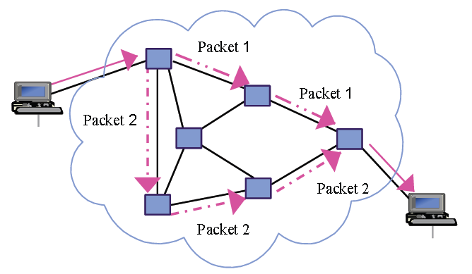

# Netzwerke und Internet (6)

## Subnetting mit CIDR

Die Abkürzung **CIDR** steht für ***Classless Interdomain Routing***.

### Routing

Das Internet ist in Wirklichkeit ein Zusammenschluss von vielen kleinen Subnetzen (*Subnets*). An den Grenzen zwischen Subnetzen sind Computer, die - falls erforderlich - Datenpakete von einem Subnetz in das benachbarte weiterleiten. Diese Computer werden **Router** genannt.

Oft müssen Router entscheiden welchen Weg Pakete nehmen sollen. Mit Hilfe spezieller Routing-Protokolle können Router sich einen aktuellen Überblick über den "günstigsten" Weg machen, und treffen von Fall zu Fall unter Umständen unterschiedliche Entscheidungen. Dadurch können Pakete auch unterschiedliche Wege durch das Netz zurücklegen.

---------------------------
***Weiterführende Informationen in Wikipedia:***

* [Routing](https://de.wikipedia.org/wiki/Routing)
-------------------------

### IP-Protokoll

Zuständig für das Routing ist das **Internet Protocol** (***IP***). Jedes Subnetz bekommt eine eigene Netzwerkadresse (*Subnet-Address*), aufgrund derer der Router die Wegentscheidung treffen kann.

Solange ein Paket nicht am Zielrechner angelangt ist, wird es an das "beste" benachbarte Subnetz weitergegeben. Eine solche Weitergabe wird **Hop** genannt.

Damit Pakete nicht endlos im Netz herumschwirren, wird bei jedem Hop der Wert im 8-Bit großen TTL-Feld des IP-Header um 1 reduziert. Beim Wert 0 wird das Paket nicht mehr weitergeleitet, was einer Zerstörung des Pakets gleichkommt. Das Paket konnte dann sein Ziel nicht finden. Die Abkürzung **TTL** steht für ***Time to Live***.

Siehe auch:  
* [Youtube-Video Routing](https://www.youtube.com/watch?v=ToHBZJ5uwAk)
* [Youtube-Video: Technik-Museum Internet](https://www.youtube.com/watch?v=uIZh2v7YpP4)

---------------------------
***Weiterführende Informationen in Wikipedia:***

* [Hop (networking) - englisch](https://en.wikipedia.org/wiki/Hop_(networking))
* [Hop (Netzwerktechnologie) - deutsch](https://de.wikipedia.org/wiki/Hop_(Netzwerktechnologie))
-------------------------

### Netzwerkadressen und CIDR

Eine IP-Adresse besteht aus zwei Teilen, einem Netzwerk- und Geräteteil. Zu Beginn des Internets wurde mit Hilfe von Netzklassen diese Unterscheidung getroffen. Seit 1993 wird das **Classless Inter-Domain Routing** (**CIDR**) Verfahren verwendet.

Beim CIDR wird die binäre IP-Adresse mit Hilfe einer Netzmaske (bei IPv4) oder Präfixlänge (IPv4 und IPv6) in die beiden Teile Netzwerk- und Geräteteil unterteilt.

Beispiel: IPv4-Adresse der HTL in Arnfels

Bezeichnung | Wert
 :-- | :--
IPv4 Adresse         | **`188.20.185.182`**
IPv4 (hexadezimal)   | `BC 14 B9 B6`
Mit Netzmaske        | `188.20.185.182/255.255.255.252`
Mit Präfixlänge      | `188.20.185.182/30`
Netzmaske (binär)    | `1111 1111   1111 1111   1111 1111   1111 1100`
IPv4 (binär)         | `1011 1100   0001 0100   1011 1001   1011 0110`
Netzwerkteil (binär) | `1011 1100   0001 0100   1011 1001   1011 01__  `
Geräteteil (binär)   | `____ ____   ____ ____   ____ ____   ____ __10`

Siehe auch: [Youtube-Video CIDR](https://www.youtube.com/watch?v=mOxDgAKIDfs)

---------------------------
***Weiterführende Informationen in Wikipedia:***
* [IPv4 Netzwerkteil und Geräteteil](https://de.wikipedia.org/wiki/IP-Adresse#Netzwerkteil_und_Ger%C3%A4teteil)
* [Classless Inter-Domain Routing](https://de.wikipedia.org/wiki/Classless_Inter-Domain_Routing)
---------------------------

### Private IP-Adressen

Damit im internen Heim- und Firmenbereich TCP/IP Netze ohne offizielle IP-Adressen errichtet werden können, sind bestimmte Adressbereiche als **private Adressen** definiert. Diese werden im öffentlichen Netz (Internet) nicht verwendet.

* **IPv4**: 

   Erste Adresse | Letzte Adresse | CIDR-Notation | Anzahl
    :----------- | :------------ | :----------- | -----: 
    `192.168.0.0` | `192.168.255.255` | `192.168.0.0/16` |     65.536
    `172.16.0.0`  | `172.31.255.255`  | `172.16.0.0./12` |  1.048.576
    `10.0.0.0`    | `10.255.255.255`  | `10.0.0.0./8`    | 16.777.216

* **IPv6**  
Alle Adressen die mit `fd00` beginnen.

---------------------------
***Weiterführende Informationen in Wikipedia:***
* [Private IP-Adresse](https://de.wikipedia.org/wiki/Private_IP-Adresse)
---------------------------

